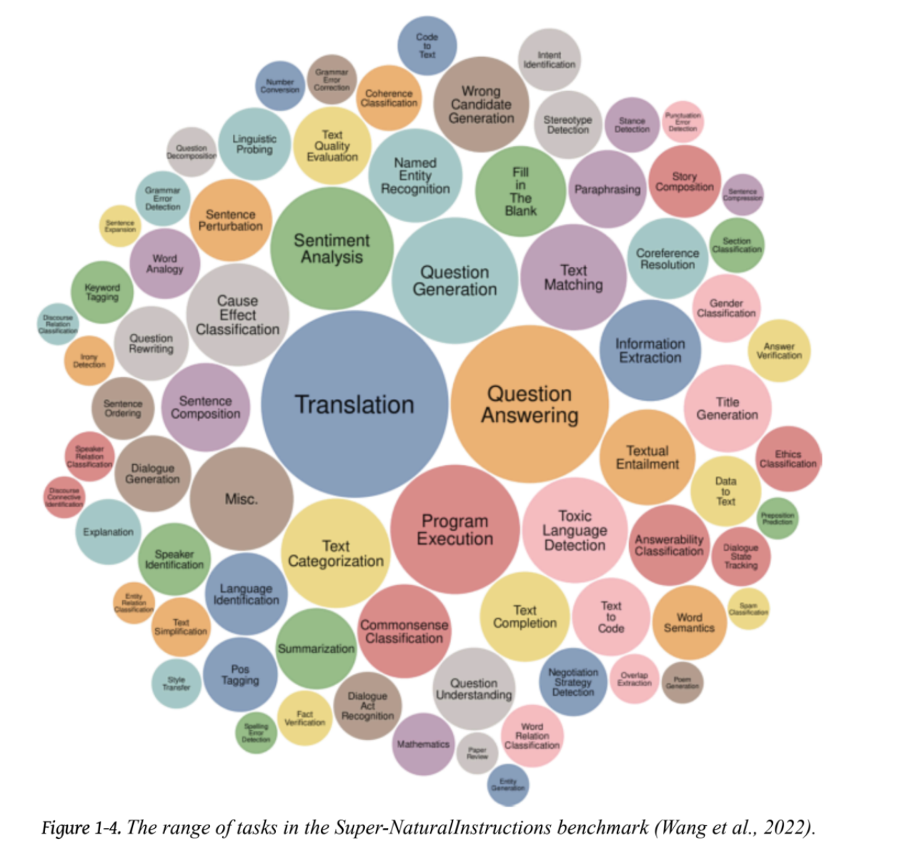
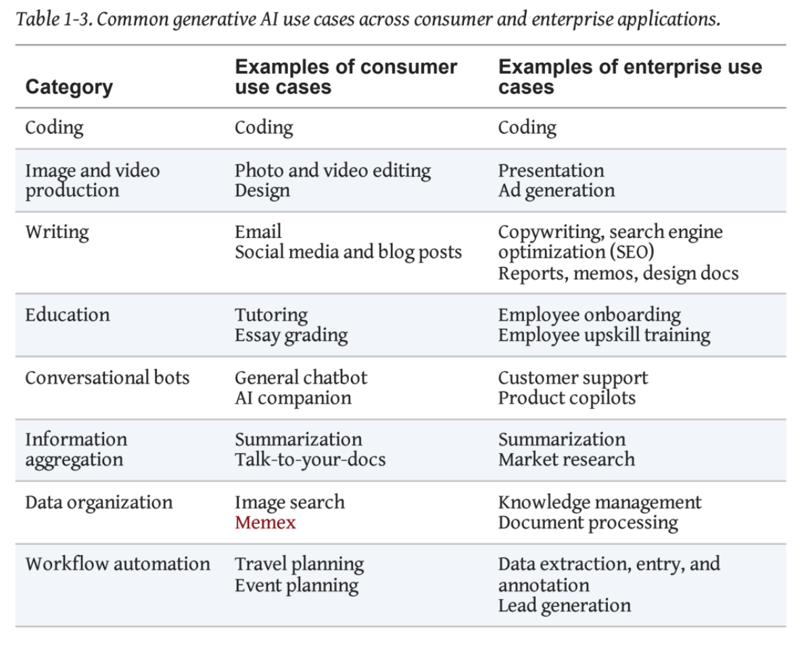

# Chapter 1. Introduction to Building AI Applications with Foundation Models

Developing AI models has traditionally required significant resources and
specialized expertise. Model as a Service (MaaS) simplifies this process by
providing developers with access to advanced AI capabilities via APIs,
eliminating the need to build or maintain models in-house.

## A. The Rise of AI Engineering

### 1. From Language Models to Large Language Models

- Language models utilize statistical properties of language for tasks such as
  text generation and comprehension.
- **Historical context:** Claude Shannon’s foundational work in information
  theory (entropy, redundancy, channel capacity) laid the groundwork for
  language modeling.
- Early language models were limited in scope and typically focused on single
  languages.
- **Tokenization** divides text into tokens (words or sub-words), forming a
  vocabulary. This approach captures more semantic meaning than character-level
  processing and enhances model efficiency.
  - _Example:_ "unhappiness" → "un", "happi", "ness"
- **Types of language models:**
  - **Masked Language Models (MLMs):** Predict missing tokens within a sequence
    (e.g., BERT).
  - **Autoregressive Language Models (ARLMs):** Predict the next token in a
    sequence (e.g., GPT).

> This book focuses on Autoregressive Language Models (ARLMs).

- **Self-supervised learning:** Models learn from unlabeled data by predicting
  parts of the input, enabling scalable training on large datasets.
- **Supervised learning:** Relies on labeled data, which is often costly and
  time-consuming to obtain.
- **Unsupervised vs. self-supervised:** Unsupervised learning uses no labels;
  self-supervised learning generates labels from the input data itself.
- **Large Language Models (LLMs):** Decoder-only architectures trained on
  massive datasets using self-supervised learning. LLMs generate human-like text
  and perform a wide range of language tasks.

### 2. From Large Language Models to Foundation Models

- Historically, AI research was segmented by data modality: NLP (natural
  language processing) for text, CV (computer vision) for images, and ASR
  (automatic speech recognition) for audio.
- **Foundation models** are designed to operate across multiple modalities, such
  as text and images. When these models generate outputs in more than one
  modality, they are referred to as **large multimodal models (LMMs)**.

  

### 3. From Foundation Models to AI Engineering

- **AI Engineering** is the discipline of building AI applications using
  foundation models. Key components include:
  - **Model as a Service (MaaS):** Utilizing pre-trained models via APIs.
  - **Prompt Engineering:** Crafting effective inputs to guide model outputs.
  - **Fine-tuning:** Customizing models for specific tasks or domains.
  - **Evaluation and Monitoring:** Assessing performance and ensuring
    reliability.
- The rapid expansion of AI Engineering is driven by:
  - The versatility of general-purpose models, which can address a broad array
    of tasks compared to earlier, task-specific models.
  - Increased investment and interest in AI technologies.
- **Low barrier to entry:** Developers can integrate advanced models into
  applications without deep AI expertise. MaaS provides straightforward access
  to powerful models, removing the need for extensive infrastructure.

- **Common generative AI use cases** in consumer and enterprise environments
  include:

  

[Figure 1-7](https://www.oreilly.com/library/view/ai-engineering/9781098166298/ch01.html#ch01_figure_7_1730130814920012)
illustrates the distribution of these use cases among 205 open source
applications. The relatively small proportion of education, data organization,
and writing use cases reflects their prevalence in proprietary or enterprise
contexts rather than open source. Developers may find these applications more
suitable for internal enterprise deployment.

  

###### Figure 1-7. Distribution of use cases in 205 open source GitHub repositories.

Enterprises often prioritize lower-risk AI applications. According to the
[2024 a16z Growth report](https://oreil.ly/XWeDt), organizations are more likely
to deploy internal-facing applications (e.g., knowledge management) than
external-facing solutions (e.g., customer support chatbots), as shown in Figure
1-8. Internal applications enable organizations to build AI expertise while
mitigating risks related to privacy, compliance, and operational failures. Many
foundation model applications remain close-ended (e.g., classification), as
these are easier to evaluate and manage.

  

###### Figure 1-8. Companies more readily deploy internal-facing AI applications.

**Terminology**

- **Internal-facing applications:** Used within an organization, often for
  knowledge management or internal tools.
- **External-facing applications:** Customer-facing, such as chatbots or support
  systems.

**Coding Tools**

- Extracting structured data from unstructured text (e.g., AgentGPT)
- Converting natural language to code (e.g., OpenAI Codex, PandaAI, SQL Chat)
- Generating code from designs or screenshots (e.g., screen-to-code, draw-a-ui)
- Translating code between programming languages (e.g., Python to JavaScript)
- Generating code documentation (e.g., Autodoc)
- Creating tests (e.g., PentestGPT)
- AI-assisted code commits

**Average Task Completion Time Reduction with Generative AI**

  

- **Code documentation:** The process of creating descriptions and comments that
  explain how code works, its purpose, and usage.
- **Code refactoring:** The process of restructuring existing code without
  altering its external behavior to improve readability, maintainability, or
  performance.

# AI Product Defensibility

- **Defensibility** refers to the ability of an AI product to maintain its
  competitive advantage and protect against imitation or disruption.

**Core Challenges:**

- **Easy to build = easy to copy:** Low barriers to entry using foundation
  models mean competitors can quickly replicate your product.
- **Shallow moat:** Traditional defensibility strategies are less effective when
  the underlying technology is commoditized.

**Platform Risks:**

- **Building on borrowed power:** Applications are often just a layer on top of
  someone else’s model (e.g., GPT, Claude).
- **Feature absorption threat:** As foundation models improve, they may directly
  incorporate your app’s functionality.
- **Obsolescence risk:** Specialized tools can become redundant as base models
  advance.

**PDF Parsing Example:**

- **Temporary advantage:** Building PDF tools was valuable when ChatGPT lacked
  PDF capabilities.
- **Advantage erosion:** As ChatGPT improves PDF processing, such applications
  lose their core value.
- **Competitive weakness:** Market position weakens when foundational
  assumptions change.

**Defensive Strategies:**

- **Target open-source users:** Serve customers who require in-house model
  hosting.
- **Focus on deployment needs:** Build for on-premises, security, or compliance
  requirements.
- **Add unique value layers:** Develop features around workflow, user
  experience, or integrations that are difficult for models to replicate.

**Key Takeaway:**\
Defensibility must extend beyond filling capability gaps in foundation models,
or products risk obsolescence with each model update.

**Three Competitive Advantages for AI Products:**

- **Data Advantage:** Unique datasets that improve model performance.
- **Technology Advantage:** Proprietary algorithms or architectures that enhance
  model capabilities.
- **Distribution Advantage:** Established channels or platforms that facilitate
  user acquisition and retention.

# Setting Expectations

- How will you measure the success of your AI product?
- Key quality metrics:
  - **Accuracy:** How well does the model perform on intended tasks?
  - **Latency:** How quickly does the model respond to queries? (including TTFT
    – Time To First Token and TPOT – Time Per Output Token)
  - **Scalability:** Can the model handle increased load without performance
    degradation?
  - **User Satisfaction:** Are users finding the model’s outputs useful and
    relevant?
- **Cost Efficiency:** Is the model’s operational cost sustainable relative to
  its value?

# AI Engineering Stack

- **Application Development**
  - AI Interface
  - Prompt Engineering
  - Context Construction
  - Evaluation

- **Model Development**
  - Inference Optimization
  - Dataset Engineering
  - Model Training
  - Evaluation

- **Infrastructure**
  - Compute Management
  - Data Management
  - Serving
  - Monitoring

# AI Engineering vs. ML Engineering

- **AI Engineering** focuses on building applications using foundation models,
  emphasizing prompt engineering, fine-tuning, and model evaluation.
- **ML Engineering** involves developing and deploying machine learning models,
  including data preprocessing, model training, and performance optimization.

- Model adaptation is a key aspect of AI Engineering, enabling customization for
  specific tasks or domains.
- **Model adaptation techniques:**
  - **Fine-tuning:** Adjusting a pre-trained model on a smaller, task-specific
    dataset.
  - **Prompt tuning:** Modifying input prompts to guide the model’s responses.
  - **Adapter layers:** Adding small, trainable layers to a pre-trained model
    without modifying the entire architecture.
